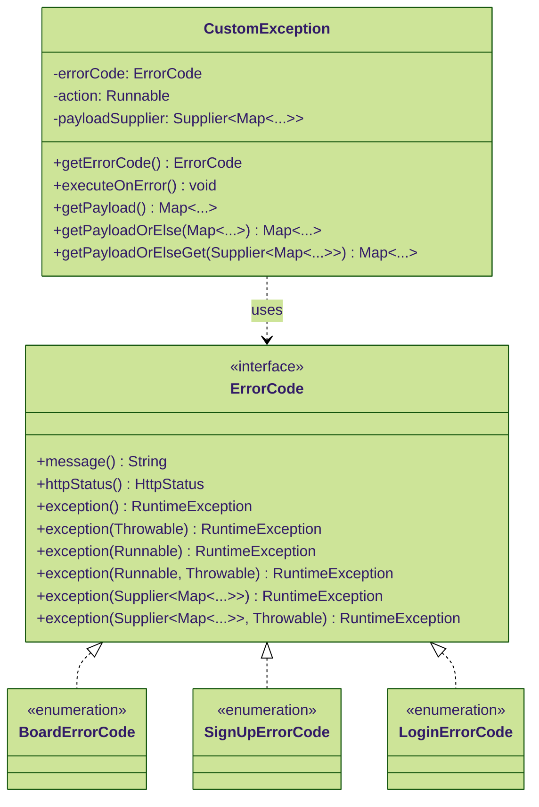

# 설명

> &lt;&lt;interface&gt;&gt; ErrorCode를 통해 간편하고 유지보수 친화적인 에러 핸들링 구조를 지향합니다.
> 비대한 &lt;&lt;enum&gt;&gt; ErrorCode의 단점을 극복하고 편의성을 유지하며, 유지보수성을 높입니다.
> 또한 이를 핸들링하는 GlobalExceptionHandler 예제를 포함합니다.

# Prerequisites

- **Syntax Level**: above JDK 17 if using preview or above 20
- **Docker Compose** (Now pure docker supplies docker compose as well)

# Features

**확장성 있는 에러코드 설계를 제공합니다.**  
대부분의 기능은 예시이므로, 종종 필요 이상으로 구현되거나 너무 간단한 구현을 제공할 수 있습니다.

## Interface Error Code

에러코드는(`ErrorCode`) 리소스나 기능 단위로 분류할 수 있습니다.  
커스텀 예외는(`CustomException`) 런타임 예외로 생성되며, 에러코드를 핸들링합니다.

|            Class             | Description                                                                  |
|:----------------------------:|:-----------------------------------------------------------------------------|
|        (I) Error Code        | 모든 에러 코드의 상위 타입입니다. **_<ins>여러 `enum` 에러 코드에 구현하여 확장성 있는 구조를 제공합니다.</ins>_** |
|     (C) Custom Exception     | 모든 커스텀 예외들의 상위 타입 역할을 합니다.                                                   |

**Example**



## Global Exception Handler

글로벌 익셉션 핸들러는(`GlobalExceptionHandler`) 커스텀 예외와 에러코드를 한 곳에서 처리하도록 돕습니다.

|            Class             | Description                                    |
|:----------------------------:|:-----------------------------------------------|
| (C) Global Exception Handler | 커스텀 예외가 사전에 처리되지 않으면 이곳으로 전달됩니다. 예외 응답을 전달합니다. |
|    (R) API Error Response    | API 예외 응답 바디 스펙입니다. 자바 `record`로 작성됩니다.        |

# Use Case

- `ErrorCode`를 구현하는 `enum` 클래스에서 예외 상황을 간편하게 나열합니다.
- (선택 사항) 원한다면 `CustomException` 클래스를 상속받는 예외 클래스를 추가할 수 있습니다.
  이것은 보통 리소스나 기능 단위로 생성하면 충분하고, 그보다 구체적인 예외 상황을 `ErrorCode` 구현부를 사용하여 분류합니다.
- `GlobalExceptionHandler`에서 `CustomException` 및 그 자손 클래스를 모두 취급할 수 있습니다.

```java
public enum SignUpErrorCode implements ErrorCode {
    USERNAME_ALREADY_EXISTS("This username is already taken.", HttpStatus.CONFLICT),
    NICKNAME_ALREADY_EXISTS("This nickname is already taken.", HttpStatus.CONFLICT),
    PASSWORD_WITH_REPEATING_CHARACTERS(
            "The password contains 3 or more repeating characters in a row.",
            HttpStatus.BAD_REQUEST
    ),
    PASSWORD_WITH_CONSECUTIVE_CHARACTERS(
            """
            The password contains some consecutive characters like "1234" or "abcd".
            It is allowed up to 3 consecutive numbers or letters.""",
            HttpStatus.BAD_REQUEST
    ),
    PREDICTABLE_PASSWORD(
            "The password contains predictable patterns like \"qwerty\", \"ababab\" or \"101010\".",
            HttpStatus.BAD_REQUEST
    ),
    PASSWORD_ON_LEAKED_DATABASE(
            "The password is commonly used and has been leaked on other websites before.",
            HttpStatus.BAD_REQUEST
    ),
    DEFAULT("Sign up error", HttpStatus.INTERNAL_SERVER_ERROR);

    private final String message;
    private final HttpStatus status;

    SignUpErrorCode(String message, HttpStatus status) {
        this.message = message;
        this.statusCode = statusCode;
    }

    @Override
    public String message() {
        return message;
    }

    @Override
    public HttpStatus httpStatus() {
        return status;
    }

    @Override
    public SignUpException exception() {
        return new SignUpException(this);
    }

    @Override
    public SignUpException exception(Throwable cause) {
        return new SignUpException(this, cause);
    }

    @Override
    public SignUpException exception(Runnable action) {
        return new SignUpException(this, action);
    }

    @Override
    public SignUpException exception(Runnable action, Throwable cause) {
        return new SignUpException(this, action, cause);
    }

    @Override
    public SignUpException exception(Supplier<Map<String, Object>> payloadSupplier) {
        return new SignUpException(this, payloadSupplier);
    }

    @Override
    public SignUpException exception(Throwable cause) {
        return new SignUpException(this, payloadSupplier, cause);
    }
}
```

---

# 데모 실행하기

[도커 데스크톱을 설치](https://www.docker.com/products/docker-desktop/)하고 실행한 상태로 다음 명령어를 따라합니다.

```shell
# 터미널을 열고 프로젝트 루트 경로에서 실행합니다.
docker-compose up -d 
```

<details>
  <summary>내리기</summary>

  ```shell
  docker-compose down
  ```

</details>

<details>
  <summary>내리기 (보존한 데이터도 삭제하기)</summary>

  ```shell
  docker-compose down -v
  ```

</details>

로컬 DB 접속 정보 (제공된 도커 컴포즈 파일로 설치한 데이터베이스)

|   Host    | Port |    Database     | Username | Password |
|:---------:|:----:|:---------------:|:--------:|:--------:|
| localhost | 3307 | demo_db_mysql8  |   root   |   root   |

애플리케이션 실행 시, 애플리케이션 서버의 기본 접속 정보는 다음과 같습니다.

- http://localhost:8080

---

# 함께 보기

- [Letsdev ErrorCode API](https://github.com/merge-simpson/letsdev-error-code-api)
  - 순수한 자바 환경에 사용할 수 있는 `BaseErrorCode`, `BaseCustomException` 클래스를 제공합니다.
  - 스프링 환경에서 사용할 수 있는 `ErrorCode`, `CustomException` 클래스를 제공합니다.